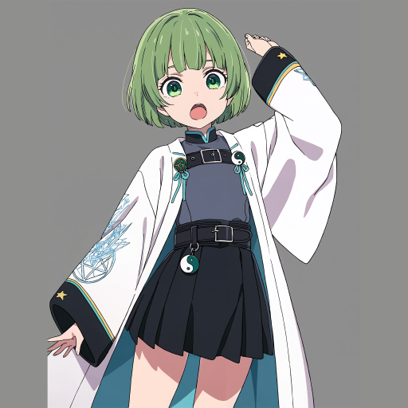
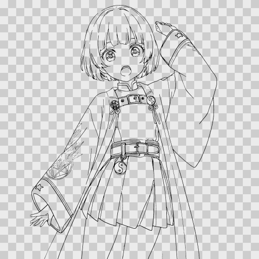
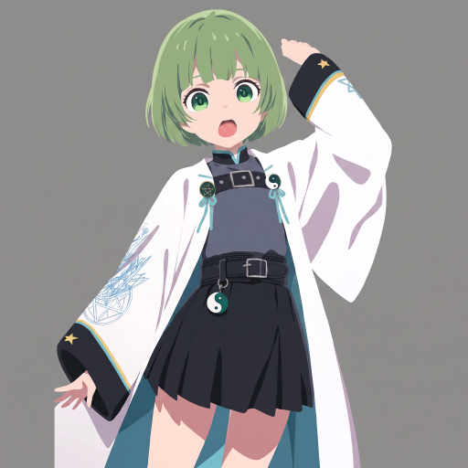
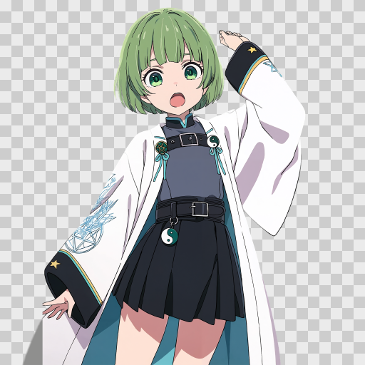

# img2psd

画像を入れると、線画抽出 → AI着色 → 背景透過 → レイヤーPSD書き出しまで自動で行う。
画像生成は社内 Esora API（既定 `azure_gpt_image_2` / GPT Image 2）。

| 入力 | 線画 | AI着色 | 背景透過 |
|---|---|---|---|
|  |  |  |  |

## 準備（初回だけ）

1. `setup.bat` をダブルクリック
2. Esora CLI を導入

## 使い方

1. `run.bat` をダブルクリック（サインインが切れていれば自動で案内）
2. 開いた画面に画像をドラッグ&ドロップ
3. 終わると PSD のリンクが出る。実体は `out/` フォルダ

## 画面

- `http://127.0.0.1:7860/` … 新UI
- `http://127.0.0.1:7860/gradio` … 旧UI

## 主な設定（新UIの「詳細設定」）

| 項目 | 既定 | 変えるとき |
|---|---|---|
| Esora モデル | GPT Image 2 | 絵柄が好みでないとき |
| プロンプト | 線画を消して色だけ出す指示 | 用途が違うとき |
| 背景透過 | ON | 背景を残したいとき OFF |
| キー色 | green | キャラに緑が使われているとき |
| 線画も参照画像として送る | OFF | 線が崩れるとき ON |

## 出力（`out/`）

| ファイル | 中身 |
|---|---|
| `*_square.png` | 2048×2048 にパディングした入力 |
| `*_lineart.png` / `.svg` | 抽出した透過線画 |
| `*_generated.png` | AI着色 |
| `*_keybg.png` | 背景をキー色にした版（マスク用） |
| `*_cutout.png` | 背景透過した結果 |
| `*_layers.psd` | 最終PSD |

## 困ったとき

| 症状 | 対処 |
|---|---|
| サインインエラー | `esora-api auth login`（最大24時間で切れる） |
| `esora-api` が見つからない | 上の「準備」2 を実行 |
| ポートが使用中 | `run.bat 7870` |
| 輪郭に緑の縁が残る | キー色を magenta / blue に変更 |

## 認証について

APIキーは不要。業務用 Google アカウントのブラウザサインインで認証する。
トークンの保存と更新は `esora-api` CLI が持ち、アプリはそれを借りるだけ。
CLI でサインアウトすればアプリも使えなくなる。

---

線画抽出・マッティング・PSD書式などの技術的な詳細は
[docs/technical_notes.md](docs/technical_notes.md) を参照。
